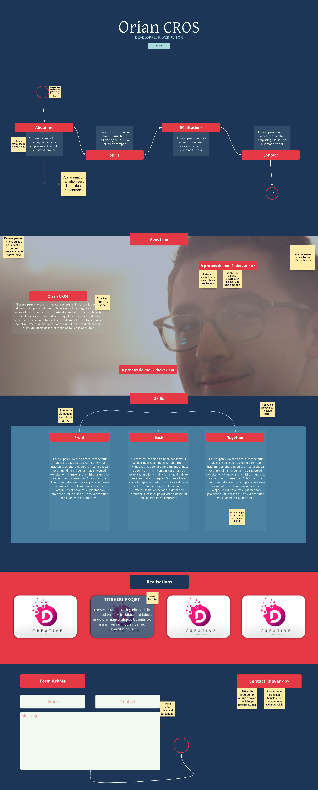

# Projet : Réaliser son portfolio responsive

Pour réaliser se projet, 
- Je commence par un **benchmark** des portfolios existants de développeur web junior. 
- Puis je cherche à effectuer ma propre **maquette** graphique pour en dégager une première structure, une organisation qui me permettra de construire le squelette de mon site vitrine. 
- Par la même occasion j'essaye d'en tirer des **premiers élèments de style**, d'identité visuelle.
  

# Benchmark

Après avoir fait des recherches, je choisis une liste des portfolios qui m'ont le plus inspirés et je relève des préférences structurelles et des bonnes pratiques :

https://snicolas.fr/

- One-page
- Le style épuré (code couleur sobre, font sans sérif)
- Les animations en fade-in
- Structure A propos, Exp, Skills, Realisations, Contact

https://mattfarley.ca/

- Le style épuré (code couleur sobre, font sans sérif)
- Skills typé

https://julien-dahy.com/

- Design plus fournis moins épuré
- Skills typé

https://technext.github.io/namari/index.html

Le tmeplate HTML5 Namari

- Organisation de paragraphe très professionnelle
- Les paragraphes "font" la structure, le contenu est donc au centre de l'attention
- Stylé épuré, clair

# Maquettage 

Je choisis d'utiliser [Lucid.app](https://lucid.app/) pour construire une première maquette et une première structure de mes idées. L'app m'a permis d'annoter sur ma maquette des informations qui me seront utile. En voici le résultat :

# Problématique

Suite à l'intégration de cette maquette je relève certain point qui ne corresponde pas à mes attentes :

## Design :
- La palette de couleur donne un sentiment de lourdeur et manque de maturité.
- La section skills risque de ne pas être très clair le choix de présentation n'est pas le bon
- La section "about me" ne met pas assez bien en avant mes expériences.

## Technique :

- Le manu "nav"
  - Son design particulier pose très vite des problèmes de responsive
  - Ses interactions et animations sont techniquement difficile

# Résolution

C'est donc une fois cette première maquette intégrér et une nouvelle étude de mon benchmark que je choisi de :
##   Design
- Changer le code couleur pour un effet plus léger et épuré
- Normer mes sections et mon contenu autour du template "Namari" pour être sûr que le contenu reste visible et lisible
- Revoir la lisibilité des compétences sous forme de logo pour améliorer la lisibilité
- Mettre en place une gallerie des réalisations plus "originale", les parties précedentes du portfolio étant revus de façon plus classique pour améliorer la lisibilité, mettre un coup d'originalité sur la gallerie en posera pas problème vus que celle-ci n'est composée que d'image avec descriptif :hover

**Fil conducteur** : une timeline du haut vers le bas pour guider la lisibilité du lecteur (celle ci sera visible en dehors du format mobile qui lui serra rangé par section vh-100 ne posant pas de problème de lisibilité) (display-none en mobile et réorganisation des flex-direction etc... géré par media-queries et par bootstrap)

## Technique
- Simplifier la barre de nav pour ne pas avoir de problématique de responsive
- Appel de la bibliothèque AOL pour les effets jQuery de fade-in
- Utilisation de bootstrap pour l'organisation de la page et le changement de structure en mobile

# Chronologie de travail

1.0.0 , 4 avril :
- Structure  globale OK
- Choix des sections OK

1.0.1, 5 avril :
        Done :
        - Revoir la Gallery de réalisation en plaçant le détail sur l'image en hover plutôt qu'en dessous pour éclairer la lisibilité.

        To  do  next :
                Général
        - Normer autour du projet Namari pour les présentations de paragraphe
        - Mettre en place des médiaqueries pour une responsive plus propre des textes nottament des titres h1 h2 h3 h4.

                Présentation
        - Mieux indiquer la présence du CV
        - Revoir la taille de la "présentation" en mode LG 
                
                Skills
        - Prévoir section Skills encore vide
                
                Footer
        - Prévoir footer / Link Git, Linkedin, droit du site.
                
                Contact
        - Ajouter du padding bot au contact
        - Ajouter un message windows open, ou prompt, ou pop up bootstrap, pour confirmer l'envoie du mail de contact
        
1.0.2, 6 avril :
        
        Done
        - Création d'une section Formation Namari normed
        - Ajouter du padding bot au contact

         To  do  next :

        Voir le responsive et la strucutre en lecture verticale comme la sestion "Formation". Jouer sur les fade-up et down pour un effet fluide. Rester épurer.

        Réalisation : Les titres et description à droite, les images à gauche.

        Skills

                Général
        - Normer autour du projet Namari pour les présentations de paragraphe
        - Mettre en place des médiaqueries pour une responsive plus propre des textes nottament des titres h1 h2 h3 h4.

                Présentation
        - Mieux indiquer la présence du CV
        - Revoir la taille de la "présentation" en mode LG 
                
                Skills
        - Prévoir section Skills encore vide
                
                Footer
        - Prévoir footer / Link Git, Linkedin, droit du site.
                
                Contact
        - Ajouter un message windows open, ou prompt, ou pop up bootstrap, pour confirmer l'envoie du mail de contact

1.0.3, 8 avril : 

         Done
        - Création d'une section Formation Namari normed
        - Ajouter du padding bot au contact
        - Prévoir section Skills encore vide

         To  do  next :

        Voir le responsive et la strucutre en lecture verticale comme la sestion "Formation". Jouer sur les fade-up et down pour un effet fluide. Rester épurer.

                Général
        - Normer autour du projet Namari pour les présentations de paragraphe
        - Mettre en place des médiaqueries pour une responsive plus propre des textes nottament des titres h1 h2 h3 h4.

                Présentation
        - Mieux indiquer la présence du CV
        - Revoir la taille de la "présentation" en mode LG 

                Skills
                
                
                Réalisation
        Les titres et description à droite, les images à gauche.

                Footer
        - Prévoir footer / Link Git, Linkedin, droit du site.
                
                Contact
        - Ajouter un message windows open, ou prompt, ou pop up bootstrap, pour confirmer l'envoie du mail de contact

1.1.0, 10 avril :

        1.1 = 
        - Refonte de la section présentation
        - Amélioration du responsive des sections formations et skills
        - Ajout d'élément graphique en LG gérée par médiaqueries
        - Gestion des animations AOS et bugFix

        DONE : 
        - Voir le responsive et la strucutre en lecture verticale comme la sestion "Formation". Jouer sur les fade-up et down pour un effet fluide. Rester épurer.
        - Normer autour du projet Namari pour les présentations de paragraphe
        - Mieux indiquer la présence du CV
        - Revoir la taille de la "présentation" en mode LG 
        - "Réalisation" les titres et description à droite, les images à gauche.

        TO DO :
        - Finir le contenu des réalisations
        - Prévoir la pop-up 
        - Prévoir footer / Link Git, Linkedin, droit du site.

1.1.1, 11 avril :

        DONE : 
        - Finir le contenu des réalisations
        TO DO :
        - Prévoir la pop-up 
        - Prévoir footer / Link Git, Linkedin, droit du site.

